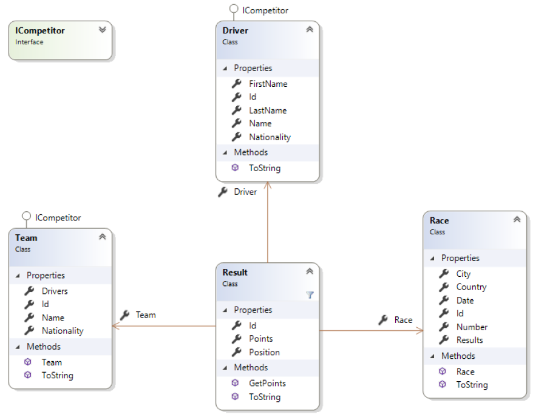

# Entity Framework – Formula1 Importer

# Lehrziele

* Entity Framework
* Annotationen

Ziel dieser Übung ist die Grundlagen des Datenbankzugriffs per Entity Framework kennen zu lernen.
Erweitern Sie dazu das Beispiel aus der Vorwoche um die Möglichkeit, die aus den XML-Dateien eingelesenen Informationen, in einer Datenbank zu persistieren.

# Klassendiagramm

# Aufgabenstellung

Stellen Sie mittels Annotationen folgende Einschränkungen sicher ([Hilfestellung](https://www.learnentityframeworkcore.com/configuration/data-annotation-attributes)):

1. Klasse Driver
   * FirstName (Pflichtfeld, max. Länge 50 Zeichen)
   * LastName (Pflichtfeld, max. Länge 50 Zeichen)
1. Klasse Race
   * Number (Optional)
   * Country (Pflichtfeld, max. Länge 200 Zeichen)
   * City (Pflichtfeld, max. Länge 200 Zeichen)
   * Date (Pflichtfeld, SQL Server Datentyp „date“)
1. Klasse Team
   * Name (Pflichtfeld, max. Länge 50 Zeichen)
   * Nationality (Pflichtfeld, max. Länge 50 Zeichen)
1. Klasse Result
   * Race (Pflichtfeld, Fremdschlüssel: RaceId)
   * Team (Pflichtfeld, Fremdschlüssel: TeamId)
   * Driver (Pflichtfeld, Fremdschlüssel: DriverId)

Die im Projekt `Formula1.PersistenceTests` hinterlegten Unit Tests müssen erfolgreich ausgeführt werden können!

Erweiterten Sie die bestehenden Unit Tests mit eigenen Prüfungen.